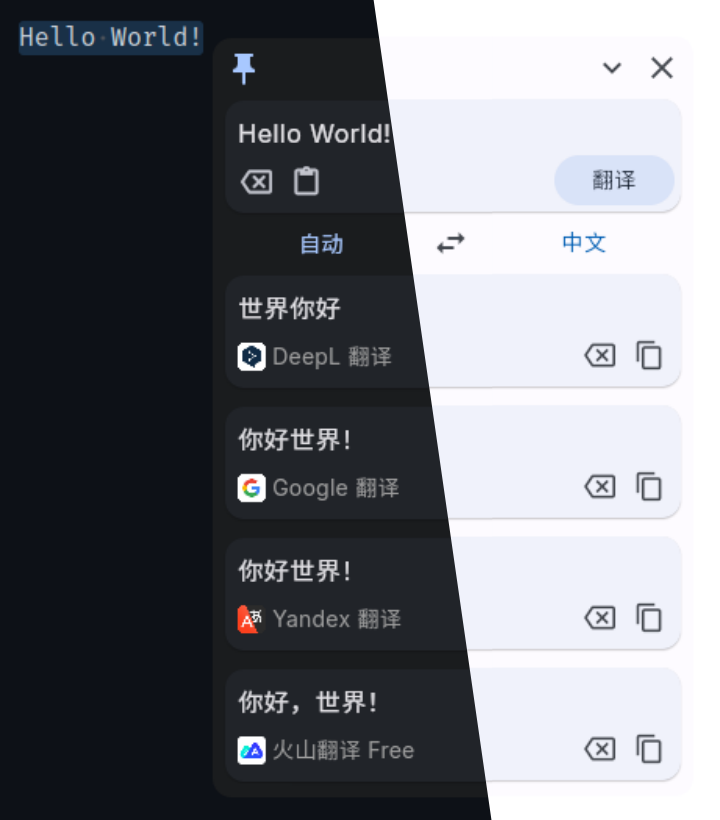

  <h1>
    <image src="assets/logo.svg" alt="MeTranslate" width=80/>
     质感翻译
  </h1>
  
划词翻译软件，使用 Flutter 开发，支持多个翻译模型

  

    
    
  

  

## 说明

- 使用 [Flutter](https://flutter.dev) 开发
- 目前仅在 Linux 上进行开发和测试
- 理论上也适用于 Windows 和 MacOS（没试过，不知道）
- 支持自定义快捷键和全局字体
- 支持自动复制和删除换行
- 支持设置代理

## 翻译服务

| 分类      | 翻译服务                                                       |
| --------- | -------------------------------------------------------------- |
| 无需配置  | Bing 翻译、DeepL 翻译、Google 翻译、Yandex 翻译、火山翻译 Free |
| 需要 API  | 百度翻译、彩云小译、小牛翻译、火山翻译、有道翻译               |
| AI 大模型 | MiniMax、智谱 AI                                               |

## 致谢

- 质感翻译的灵感来源于：[pot](https://github.com/pot-app/pot-desktop)
- 感谢 [LeanFlutter](https://github.com/leanflutter) 提供的一系列桌面端 Flutter packages

## 更新日志

[CHANGELOG](./CHANGELOG.md)

## License

[GNU GPL-3.0](./LICENSE)
