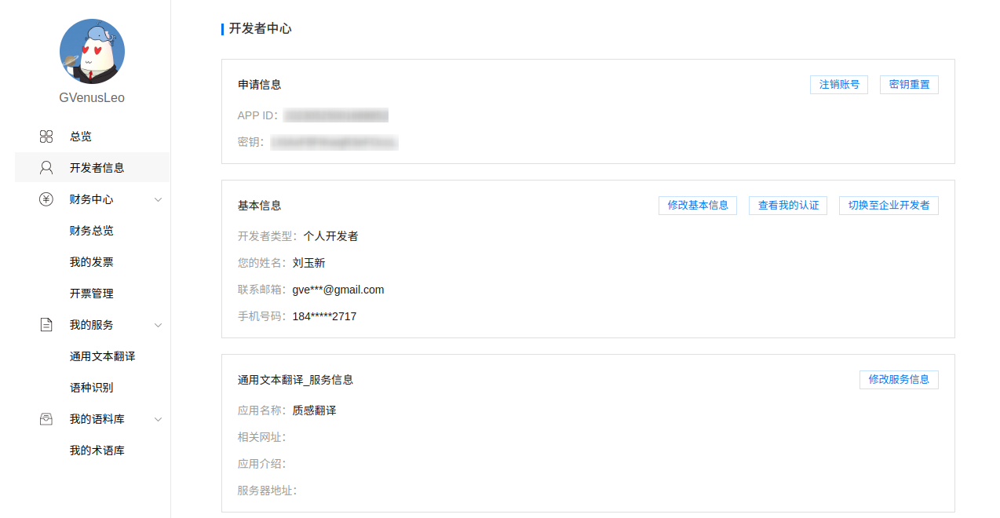

# 百度翻译

::: info 注意
此文档内容可能会过时，请以[百度翻译开放平台](https://fanyi-api.baidu.com/)内容为准。
:::

## 百度翻译 API 定价

百度翻译 API 接口提供三种版本：标准版、高级版、尊享版。个人用户注册后可使用标准版，实名认证后自动升级为高级版，尊享版仅限企业用户使用。

- 标准版：每月前 5 万字符免费，超出部分按 49 元 / 100 万字符计费。
- 高级版：每月前 100 万字符免费，超出部分按 49 元 / 100 字符计费。

::: info 说明
费用由百度在百度翻译开放平台收取，与 Lex 无关。
:::

## API 申请步骤

### 第一步：登录百度翻译开放平台

访问[百度翻译开放平台](https://fanyi-api.baidu.com/)，点击右上角的「登录」按钮，使用百度账号登录。

登录成功后点击进入「管理控制台」。

### 第二步：注册成为百度翻译开发者

第一次进入管理控制台会让你注册成为百度翻译开发者。选择「个人开发者」并填写表单后点击「下一步」。

注册成功后会提醒进行身份认证，如果不想用高级版可以点「取消」，否则继续认证身份认证。

### 第三步：开通「通用翻译服务」

注册成功后，打开[控制台](https://fanyi-api.baidu.com/api/trans/product/desktop)，点击「立即开通」按钮，选择「通用翻译（适用于文本翻译）」并点击「下一步」 选择「开通标准版」 填写应用名称 Lex（可自定义）然后点击「提交申请」，会提示「开通成功」。

完成以上步骤之后，就可以使用标准版接口了。如果已经完成身份认证并想使用高级版接口，可以在[控制台](https://fanyi-api.baidu.com/api/trans/product/desktop)点击写有「标准版」的下拉框即切换为高级版。

### 第四步：查看并填写 APPID 和 密钥

前往[百度翻译开放平台控制台](https://fanyi-api.baidu.com/api/trans/product/desktop)，点击左侧「开发者信息」，查看「APP ID」和「密钥」，进入 Lex 设置页面，依次点击「翻译服务」-「百度翻译」，将「APP ID」和「密钥」填入对应位置并保存。

现在就可以在 Lex 中使用百度翻译服务了。

## 语言支持

百度翻译标准版和高级版支持语种检测和以下 28 种语言：

| 中文   | 英语       | 粤语       | 文言文       |
| ------ | ---------- | ---------- | ------------ |
| 日语   | 韩语       | 法语       | 西班牙语     |
| 泰语   | 阿拉伯语   | 俄语       | 葡萄牙语     |
| 德语   | 意大利语   | 希腊语     | 荷兰语       |
| 波兰语 | 保加利亚语 | 爱沙尼亚语 | 丹麦语       |
| 芬兰语 | 捷克语     | 罗马尼亚语 | 斯洛文尼亚语 |
| 瑞典语 | 匈牙利语   | 繁体中文   | 越南语       |
