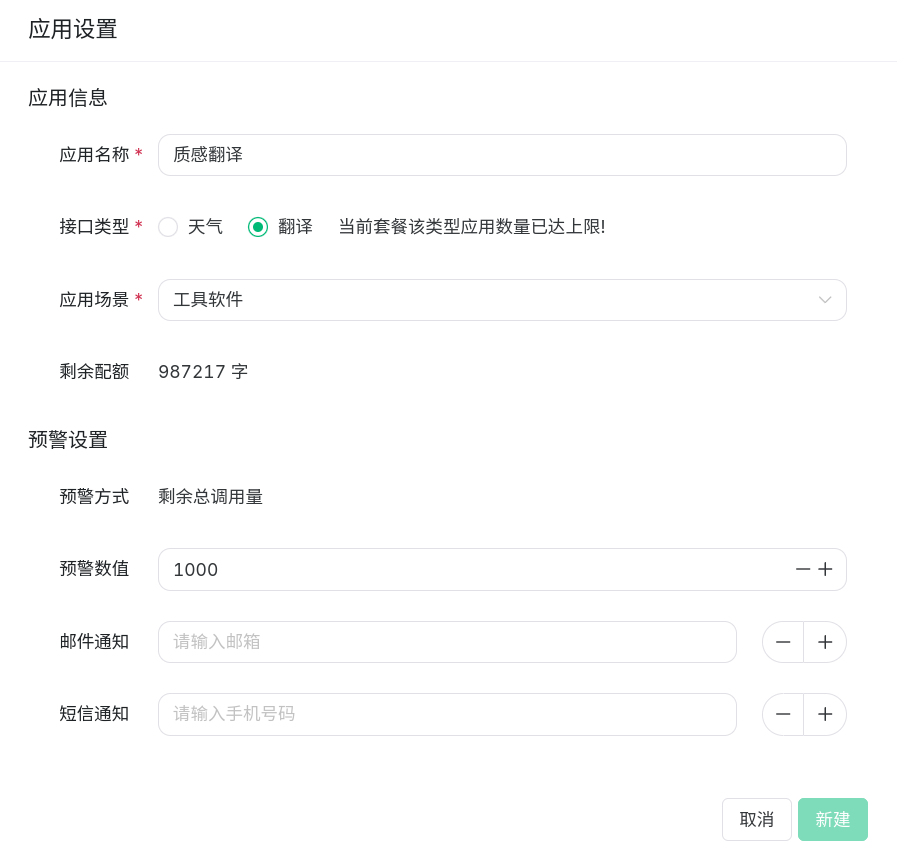
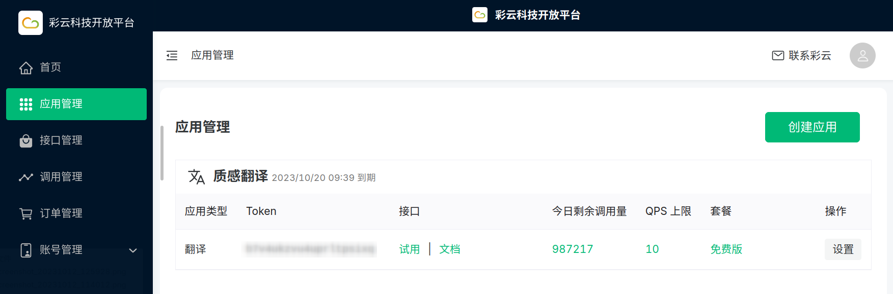

# 彩云小译

::: info 注意
此文档内容可能会过时，请以[彩云科技开放平台](https://platform.caiyunapp.com/)内容为准。
:::

## 彩云小译 API 定价

根据[官方文档](https://docs.caiyunapp.com/blog/2018/09/03/lingocloud-api)的说明，新用户注册申请 API 后会获得 100 万字的免费翻译额度，有效期一个月，超过 100 万字会按照 39 元 / 100 万字的费率收费。

::: info 说明
费用由彩云小译在彩云科技开放平台收取，与 Lex 无关。
:::

## API 申请步骤

### 第一步：完成开发者认证

进入[彩云科技开放平台](https://platform.caiyunapp.com/)，注册或登录账号，并完成开发者认证（可选个人认证或企业认证）。

### 第二步：创建应用

完成开发者认证后，进入[彩云科技开放平台](https://platform.caiyunapp.com/)的「应用管理」，点击「创建应用」，填写表单。应用名称填写 Lex（可自定义），接口类型选择「翻译」，应用场景选择「工具软件」或「其他」。预警设置可自定义。

填写完成后点击「新建」，完成应用创建。

### 第三步：查看并填写 Token

在[彩云科技开放平台](https://platform.caiyunapp.com/)的「应用管理」页面，查看创建的应用的 Token 。

进入 Lex 设置页面，依次点击「翻译服务」-「彩云小译」，将「Token」填入对应位置并保存。

现在就可以在 Lex 中使用彩云小译服务了。

## 语言支持

彩云小译 API 支持语种检测和中文、英语、日语之间的相互翻译。
