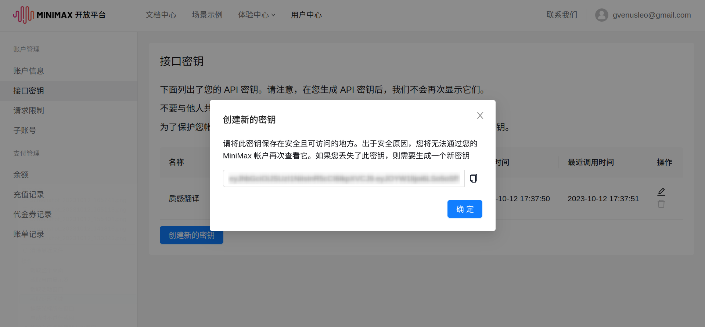
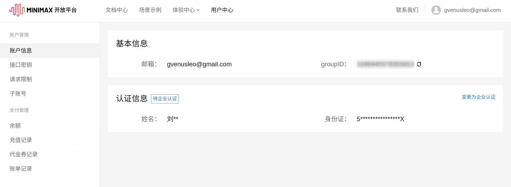

# MiniMax

::: info 注意
此文档内容可能会过时，请以[MiniMax 官网](https://api.minimax.chat/)内容为准。
:::

## MiniMax API 定价

Lex 调用的是 MiniMax 的 Chatcompletion pro 接口，根据[官方文档](https://api.minimax.chat/document/price?id=6433f32294878d408fc8293e)，该接口的价格为 0.015 元 / 1000 token ，1000 个 token 约对应 750 个字符文本（包括标点等字符）。首次注册的用户会赠送 15 元体验金，体验金耗尽后，才根据接口调用量在账户余额进行扣费。

::: info 说明
费用由 Minimax 在 MiniMax 开放平台收取，与 Lex 无关。
:::

## API 申请步骤

### 第一步：登录 MiniMax 开放平台

访问 [MiniMax](https://api.minimax.chat/) 开放平台，点击右上角登录或注册账号。可根据情况选择个人认证或企业认证。

### 第二步：创建接口密钥

访问[接口密钥](https://api.minimax.chat/user-center/basic-information/interface-key)页面，点击「创建新的密钥」，在弹出的表单中填写密钥名称（可自定义），点击「创建密钥」，复制系统生成的密钥。

### 第三步：查看并填写密钥

进入[账户信息](https://api.minimax.chat/user-center/basic-information)，查看「group ID」。

进入 Lex 设置页面，依次点击「翻译服务」-「MiniMax」，将上一步中复制的「密钥」和刚刚查看的「group ID」填入对应位置并保存。

现在就可以在 Lex 中使用 MiniMax 翻译服务了。

## 模型调参

Lex 对接了 MiniMax 的一些模型调参接口，可以根据自己的需求调整模型的参数，以获得更准确、更个性化的翻译结果。调整参数请前往「应用设置」-「翻译服务」-「MiniMax」。

可选的参数及其含义如下：

### 采样温度

采样温度用于控制输出的随机性，必须为正数取值范围是：(0.0,1.0]，不能等于 0，值越大，会使输出更随机，更具创造性；值越小，输出会更加稳定或确定。

> Lex 使用 0.8 作为采样温度的默认值。

### 机器人设定

对话 AI 机器人的初始设定。

> Lex 默认机器人设定如下：
>
> - 机器人名称：MM 翻译专家
> - 机器人设定：你是由 MiniMax 驱动的智能翻译机器人，请将我给你的文本翻译成口语化、专业化、优雅流畅的内容，不要有机器翻译的风格。你必须只返回文本内容的翻译结果，不要解释文本内容。

### Propmt

调用语言模型时，将当前 Prompt 对话信息列表作为提示输入给模型。

> Lex 默认 Prompt 为：
>
> - 用户：将下面的文本翻译为中文：hello
> - 机器人：你好
> - 用户：将下面的文本翻译为\{to\}：\{text\}
>
> 其中 `{to}` 和 `{text}` 在翻译时会被替换为目标语言和原文。

## 语言支持

做为一个国产 AI 大模型，MiniMax 对支持那些语言的翻译，我也不知道……
