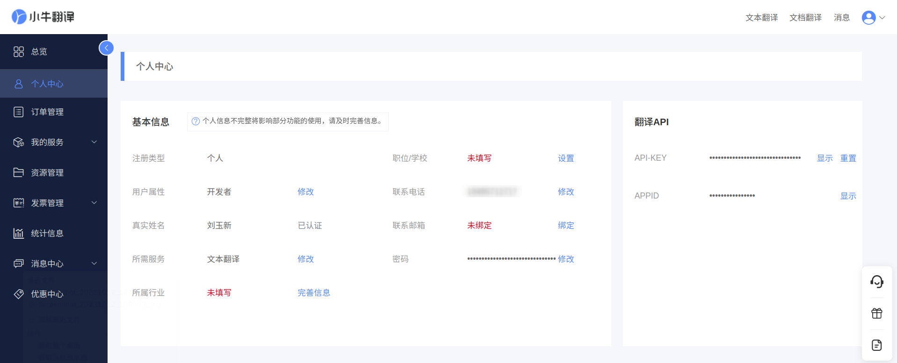

# 小牛翻译

::: info 注意
此文档内容可能会过时，请以[小牛翻译官网](https://niutrans.com/text_trans)内容为准。
:::

## 小牛翻译 API 定价

在小牛翻译控制台注册账号后，每天会获得 20 万字符的免费翻译额度。免费额度用完可以购买流量包，不同等级流量包每 100 万字符价格在 30 到 50 元之间不等。

::: info 说明
费用由小牛翻译在小牛翻译控制台收取，与「质感翻译」无关。
:::

## API 申请步骤

### 第一步：注册账号

进入[小牛翻译控制台](https://niutrans.com/cloud/)注册账号。

### 第二步：查看并填写 API Key 和 APP ID

进入[个人中心](https://niutrans.com/cloud/account_info/info)，查看「API Key」。进入质感翻译设置页面，依次点击「翻译服务」-「小牛翻译」，将「API Key」填入对应位置并保存。

现在就可以在「质感翻译」中使用小牛翻译服务了。

## 支持语言

小牛翻译**不支持语种检测**，但支持的语言极广，包括以下 452 种语言：

| 阿尔巴尼亚语           | 阿拉伯语             | 阿姆哈拉语           | 阿丘雅语              |
| ---------------------- | -------------------- | -------------------- | --------------------- |
| 阿瓜鲁纳语             | 阿卡瓦伊语           | 阿穆斯戈语           | 阿塞拜疆语            |
| 爱尔兰语               | 爱沙尼亚语           | 埃维语               | 奥吉布瓦语            |
| 奥罗莫语               | 奥利亚语             | 奥赛梯语             | 阿雅安伊富高语        |
| 艾马拉语               | 阿卡特克语           | 安蒂波洛伊富高语     | 阿奇语                |
| 安拜语                 | 奥罗科语             | 阿多拉语             | 阿格尼桑维语          |
| 阿舍宁卡语             | 埃菲克语             | 阿乔利语             | 埃桑语                |
| 埃多语                 | 阿卢尔语             | 阿亚库乔克丘亚语     | 奥克语                |
| 阿斯图里亚斯语         | 阿拉贡语             | 阿法尔语             | 阿尔及利亚阿拉伯语    |
| 阿布哈兹语             | 巴布亚皮钦语         | 巴拉萨纳语           | 巴什基尔语            |
| 巴斯克语               | 白俄罗斯语           | 白苗文               | 柏柏尔语              |
| 保加利亚语             | 冰岛语               | 比斯拉马语           | 别姆巴语              |
| 波兰语                 | 波斯尼亚语           | 波斯语               | 波塔瓦托米语          |
| 布列塔尼语             | 波孔奇语             | 班巴拉语             | 北部马姆语            |
| 巴里巴语               | 博科巴鲁语           | 布萨语               | 波拉语                |
| 巴里亚语               | 班通安隆语           | 班迪亚勒语           | 巴卡语                |
| 邦邦语                 | 巴里语               | 布阿尔考钦语         | 北部格雷博语          |
| 巴萨语                 | 布卢语               | 邦阿西楠语           | 鲍勒语                |
| 比亚克语               | 巴塔克卡罗语         | 波纳佩语             | 伯利兹克里奥尔语      |
| 巴拉圭瓜拉尼语         | 北部普埃布拉纳瓦特语 | 巴西葡萄牙语         | 邦板牙语              |
| 北索托语               | 北萨米语             | 查莫罗语             | 楚瓦什语              |
| 茨瓦纳语               | 聪加语               | 车臣语               | 查克玛语              |
| 茨鲁语                 | 茨瓦语               | 楚瓦博语             | 鞑靼语                |
| 丹麦语                 | 德语                 | 德顿语               | 迪维希语              |
| 丁卡语                 | 迪尤拉语             | 迪塔马利语           | 达迪比语              |
| 蒂穆贡-穆鲁特语        | 东部卡加延-阿格塔语  | 丹美语               | 杜阿拉语              |
| 帝力德顿语             | 德鲁语               | 蒂夫语               | 多巴巴塔克语          |
| 地峡萨波特克语         | 低地德语             | 道本语               | 俄语                  |
| 恩都卡语               | 恩舍特语             | 恩泽马语             | 恩加朱语              |
| 恩科里语               | 恩道语               | 恩敦加语             | 法语                  |
| 法罗语                 | 菲律宾语             | 斐济语               | 芬兰语                |
| 法兰钦语               | 法拉法拉语           | 佛得角克里奥尔语     | 丰语                  |
| 弗留利语               | 法兰克-普罗旺斯语    | 梵语                 | 高棉语                |
| 盖丘亚语               | 刚果语               | 弗里西语             | 格鲁吉亚语            |
| 古吉拉特语             | 瓜哈哈拉语           | 果发语               | 格森语                |
| 格巴亚语               | 龚语                 | 刚果斯瓦希里语       | 圭米语                |
| 瓜拉尼语               | 格陵兰语             | 高原马达加斯加语     | 古英语                |
| 哈萨克语               | 哈萨克语(西里尔)     | 海地克里奥尔语       | 韩语                  |
| 豪萨语                 | 荷兰语               | 黑山语               | 哈卡钦语              |
| 胡里语                 | 亥比语               | 赫雷罗语             | 胡帕语                |
| 吉尔吉斯语             | 基切语               | 加莱拉语             | 加利西亚语            |
| 加泰罗尼亚语           | 捷克语               | 基里巴斯语           | 颇语                  |
| 加语                   | 基库尤语             | 金邦杜语             | 加利富纳语            |
| 加拿大法语             | 卡拜尔语             | 卡韦卡尔语           | 卡克奇克尔语          |
| 卡纳达语               | 凯克其语             | 坎帕语               | 科普特语              |
| 科奇语                 | 科西嘉语             | 克雷塔罗奥托米语     | 克罗地亚语            |
| 库尔德语(库尔曼奇语)   | 库尔德语(索拉尼语)   | 库阿努阿语           | 库斯科克丘亚语        |
| 卡平阿马朗伊语         | 克里米亚鞑靼语       | 卡尔梅克卫拉特语     | 克利科语              |
| 卡库瓦语               | 喀克其奎语           | 卡乌龙语             | 库隆语                |
| 卡纳尔高地-基丘亚语    | 库克群岛毛利语       | 卡比耶语             | 卡姆巴语              |
| 卡昂多语               | 喀麦隆皮钦语         | 宽亚玛语             | 克林贡语              |
| 卡努里语               | 康沃尔语             | 卡舒比语             | 卢旺达语              |
| 拉丁语                 | 拉脱维亚语           | 老挝语               | 隆迪语                |
| 立陶宛语               | 林加拉语             | 卢干达语             | 卢克帕语              |
| 卢森堡语               | 罗马尼亚语           | 罗姆语               | 隆韦语                |
| 罗维那语               | 勒期语               | 临高语               | 罗子语                |
| 卢巴开赛语             | 卢巴-加丹加语        | 隆打语               | 卢乌德语              |
| 卢瓦来语               | 林堡语               | 逻辑语               | 马尔加什语            |
| 马耳他语               | 马恩岛语             | 马拉地语             | 马拉雅拉姆语          |
| 马来语                 | 马里语               | 马姆语               | 马其顿语              |
| 毛利语                 | 蒙古语               | 蒙古语(西里尔)       | 缅甸语                |
| 孟加拉语               | 曼尼普尔语           | 摩图语               | 马绍尔语              |
| 马拉瑙语               | 马勒语               | 马都拉语             | 莫西语                |
| 穆图凡语               | 米佐语               | 毛里求斯克里奥尔语   | 姆班杜语              |
| 马普切语               | 米斯特克语           | 马库阿语             | 曼代灵西马隆贡语      |
| 曼布韦-龙古语          | 门诺低地德语         | 米兰达语             | 迈蒂利语              |
| 马来语克里奥尔语       | 纳瓦特尔语           | 南非荷兰语           | 南非科萨语            |
| 南非祖鲁语             | 尼泊尔语             | 挪威语               | 南阿塞拜疆语          |
| 南玻利维亚克丘亚语     | 弄巴湾语             | 尼日利亚富拉语       | 努曼干语              |
| 纳特尼语               | 尼亚库萨语           | 纽埃语               | 尼亚斯语              |
| 涅姆巴语               | 尼荣圭语             | 纳瓦霍语             | 尼亚内卡语            |
| 尼日利亚皮钦语         | 南恩德贝莱语         | 帕皮阿门托语         | 派特语                |
| 旁遮普语               | 葡萄牙语             | 普什图语             | 佩勒-阿塔语           |
| 皮京语                 | 帕潘特拉托托纳克语   | 齐切瓦语             | 契维语                |
| 切诺基语               | 奇南特克语           | 齐马内语             | 乔奎语                |
| 乔皮语                 | 丘克语               | 钦博拉索高地克丘亚语 | 恰蒂斯加尔语          |
| 日语                   | 瑞典语               | 萨摩亚语             | 塞尔维亚语            |
| 塞舌尔克里奥尔语       | 塞索托语             | 桑戈语               | 僧伽罗语              |
| 山地马里语             | 世界语               | 舒阿尔语             | 斯洛伐克语            |
| 斯洛文尼亚语           | 斯瓦希里语           | 苏格兰盖尔语         | 索马里语              |
| 苏奥语                 | 桑贝里吉语           | 萨鲍特语             | 圣马特奥德马尔-瓦维语 |
| 斯哈语                 | 萨拉马坎语           | 桑格语               | 塞纳语                |
| 圣萨尔瓦多刚果语       | 松格语               | 索西语               | 斯高克伦语            |
| 苏格兰语(低地苏格兰语) | 书面挪威语           | 撒丁语               | 掸语                  |
| 塞尔维亚-克罗地亚语    | 斯威士语             | 上索布语             | 塔吉克语              |
| 塔希提语               | 泰卢固语             | 泰米尔语             | 泰语                  |
| 汤加语                 | 提格雷语             | 图阿雷格语           | 土耳其语              |
| 土库曼语               | 坦普尔马语           | 特丁钦语             |
| 图瓦语                 | 图马伊鲁穆语         | 腾内特语             | 通加格语              |
| 特索语                 | 图瓦卢语             | 特特拉语             | 他加禄语              |
| 通布卡语               | 托霍拉瓦尔语         | 土柔语               | 瓦拉莫语              |
| 瓦瑞语                 | 文达语               | 沃洛夫语             | 乌德穆尔特语          |
| 乌尔都语               | 乌克兰语             | 乌兹别克语           | 乌玛语                |
| 乌斯潘坦语             | 瓦利语               | 佤语                 | 瓦吉语                |
| 瓦里斯语               | 文约语               | 威尔士语             | 瓦利斯语              |
| 乌尔霍博语             | 瓦乌特拉马萨特克语   | 瓦尤语               | 瓦隆语                |
| 西班牙语               | 希伯来语             | 希尔哈语             | 希腊语                |
| 夏威夷语               | 信德语               | 匈牙利语             | 修纳语                |
| 宿务语                 | 叙利亚语             | 夏威夷克里奥尔英语   | 希里莫图语            |
| 西部拉威语             | 锡达莫语             | 西布基农马诺布语     |
| 西皮沃语               | 西罗伊语             | 西部玻利维亚瓜拉尼语 | 西部克耶语            |
| 希利盖农语             | 新挪威语             | 下索布语             | 新通用语              |
| 西方国际语             | 亚美尼亚语           | 雅加达语             | 亚齐语                |
| 伊博语                 | 意大利语             | 意第绪语             | 印地语                |
| 印尼巽他语             | 印尼语               | 印尼爪哇语           | 英语                  |
| 尤卡坦玛雅语           | 约鲁巴语             | 越南语               | 粤语                  |
| 伊卡语                 | 伊兹语               | 约姆语               | 雅比姆语              |
| 永贡语                 | 邕北壮语             | 伊普马语             | 伊索科语              |
| 伊班语                 | 伊洛卡诺语           | 伊巴纳格语           | 雅浦语                |
| 因巴布拉高地克丘亚语   | 伊多语               | 因特语               | 藏语                  |
| 中文(简体)             | 中文(繁体)           | 宗喀语               | 中部伊富高语          |
| 佐通钦语               | 中部杜顺语           | 中比科尔语           | 泽塔尔语              |
| 赞德语                 | 中部普埃布拉纳瓦特语 | 中部瓦斯特克纳瓦特语 | 中古法语              |
