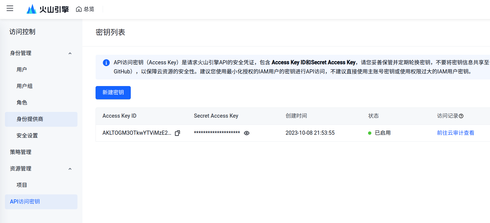

# 火山翻译

::: info 注意
此文档内容可能会过时，请以[火山引擎官方文档](https://www.volcengine.com/docs/4640/130872)内容为准。
:::

## 火山翻译 API 定价

根据[官方文档](https://www.volcengine.com/docs/4640/68515)的说明，火山翻译 每月有 200 万字符免费使用额度，超过免费额度之后即进入付费段，按照 49 元 / 100 万字的费率收费。

::: info 说明
费用由火山引擎在火山引擎控制台收取，与「质感翻译」无关。
:::

## API 申请步骤

### 第一步：完成火山引擎实名认证

前往[火山引擎官网](https://www.volcengine.com)，注册或登录账号。进入「控制台」，点击立即认证，可选择「个人实名认证」或「企业实名认证」，按照指导完成认证即可。

### 第二步：开通机器翻译服务

进入[机器翻译控制台](https://console.volcengine.com/translate/usage)，开通机器翻译服务。

### 第三步：创建访问密钥

点击右上角账号，下拉列表点击「API 访问密钥」，进入密钥列表，点击「新建密钥」，此时会提示是否要创建一个子账号来新建密钥。主账号与子账号的区别在于：

- 主账户的密钥创建方便，但具有账户的完全权限，密钥泄露可能会造成最大化的资产损失。
- 子账号的密钥创建较繁琐，但按需分配权限，安全性更高。

可按需选择上述两种创建方式。

### 第四步：查看并填写访问密钥

访问密钥创建完成后，密钥列表会出现一条新的记录，其中包括「Access Key ID」和「Secret Access Key」。进入质感翻译设置页面，依次点击「翻译服务」-「火山翻译」，将「Access Key ID」和「Secret Access Key」填入对应位置并保存。

现在就可以在「质感翻译」中使用火山翻译服务了。

## 语言支持

火山翻译支持语种检测和以下 129 种语言：

| 中文(简体)     | 中文(繁体)   | 中文(香港繁体) | 中文(台湾繁体) |
| -------------- | ------------ | -------------- | -------------- |
| 札那语         | 越南语       | 伊努克提图特语 | 意大利语       |
| 印尼语         | 印地语       | 英语           | 希里莫图语     |
| 希伯来语       | 西班牙语     | 现代希腊语     | 乌克兰语       |
| 乌尔都语       | 土库曼语     | 土耳其语       | 提格里尼亚语   |
| 塔希提语       | 他加禄语     | 汤加语         | 泰语           |
| 泰米尔语       | 泰卢固语     | 斯洛文尼亚语   | 斯洛伐克语     |
| 史瓦帝语       | 世界语       | 萨摩亚语       | 桑戈语         |
| 塞索托语       | 瑞典语       | 日语           | 契维语         |
| 奇楚瓦语       | 葡萄牙语     | 旁遮普语       | 挪威语         |
| 挪威布克莫尔语 | 南恩德贝勒语 | 缅甸语         | 孟加拉语       |
| 蒙古语         | 马绍尔语     | 马其顿语       | 马拉亚拉姆语   |
| 马拉提语       | 马来语       | 卢巴卡丹加语   | 罗马尼亚语     |
| 立陶宛语       | 拉脱维亚语   | 老挝语         | 宽亚玛语       |
| 克罗地亚语     | 坎纳达语     | 基库尤语       | 捷克语         |
| 加泰隆语       | 荷兰语       | 韩语           | 海地克里奥尔语 |
| 古吉拉特语     | 格鲁吉亚语   | 格陵兰语       | 高棉语         |
| 干达语         | 刚果语       | 芬兰语         | 斐济语         |
| 法语           | 俄语         | 恩敦加语       | 德语           |
| 鞑靼语         | 丹麦语       | 聪加语         | 楚瓦什语       |
| 波斯语         | 波斯尼亚语   | 波兰语         | 比斯拉玛语     |
| 北恩德贝勒语   | 巴什基尔语   | 保加利亚语     | 阿塞拜疆语     |
| 阿拉伯语       | 阿非利堪斯语 | 阿尔巴尼亚语   | 阿布哈兹语     |
| 奥塞梯语       | 埃维语       | 爱沙尼亚语     | 艾马拉语       |
| 中文（文言文） | 阿姆哈拉语   | 中库尔德语     | 威尔士语       |
| 加利西亚语     | 豪萨语       | 亚美尼亚语     | 伊博语         |
| 北库尔德语     | 林加拉语     | 北索托语       | 齐切瓦语       |
| 奥洛莫语       | 绍纳语       | 索马里语       | 塞尔维亚语     |
| 斯瓦希里语     | 科萨语       | 约鲁巴语       | 祖鲁语         |
| 藏语           | 闽南语       | 吴语           | 粤语           |
| 西南官话       | 维吾尔语     | 尼日利亚富拉语 | 匈牙利语       |
| 坎巴语         | 肯尼亚语     | 基尼阿万达语   | 卢欧语         |
| 沃洛夫语       |

其中，斯洛伐克语仅支持其他语言翻译到斯洛伐克语；藏语、闽南语、吴语、粤语、西南官话、维吾尔语仅支持翻译到中文。
