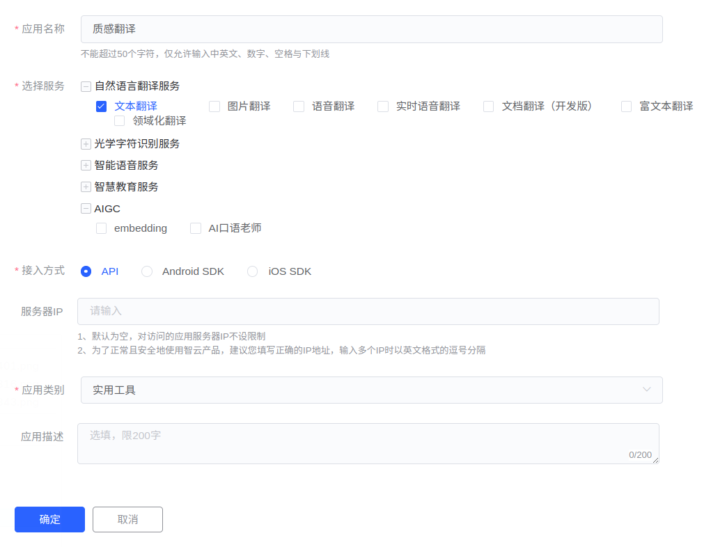

# 有道翻译

::: info 注意
此文档内容可能会过时，请以[有道智云 AI 开放平台](https://ai.youdao.com/)内容为准。
:::

## 有道翻译 API 定价

有道翻译不提供免费的 API 翻译额度，但新用户注册账户时，系统会赠予 50 元体验资金。体验金额耗尽后，才根据接口调用量在账户余额进行扣费。

| 服务内容                 | 价格（元 / 100 万字符） |
| ------------------------ | ----------------------- |
| 常见语种互译（部分除外） | 48                      |
| 中文与非常见语种互译     | 100                     |
| 其他语种间互译           | 100                     |

::: info 说明
费用由有道翻译在有道智云 AI 开放平台收取，与「质感翻译」无关。
:::

## API 申请步骤

### 第一步：登录有道智云 AI 开放平台

访问[有道智云 AI 开放平台](https://ai.youdao.com/)，点击右上角登录或注册账号。

### 第二步：创建应用

登录后，点击进入[应用总览](https://ai.youdao.com/console/#/app-overview)，点击「创建应用」，填写表单。语言名称填写「质感翻译」（可自定义），选择服务必选「文本翻译」，接入方式选择「API」，应用类别可任选。

填写完后点击「确定」即可创建应用。

### 第三步：查看并填写应用 ID 和密钥

转到[业务总览](https://ai.youdao.com/console/#/)，查看「应用 ID」和「应用密钥」。进入质感翻译设置页面，依次点击「翻译服务」-「有道翻译」，将「应用 ID」和「应用密钥」填入对应位置并保存。

现在就可以在「质感翻译」中使用有道翻译服务了。

## 支持语言

有道翻译支持自动检测语种和以下 112 种语言：

| 阿拉伯语         | 德语                   | 英语                 | 西班牙语     |
| ---------------- | ---------------------- | -------------------- | ------------ |
| 法语             | 印地语                 | 印度尼西亚语         | 意大利语     |
| 日语             | 韩语                   | 荷兰语               | 葡萄牙语     |
| 俄语             | 泰语                   | 越南语               | 中文         |
| 中文（繁体）     | 南非荷兰语             | 阿姆哈拉语           | 阿塞拜疆语   |
| 白俄罗斯语       | 保加利亚语             | 孟加拉语             | 波斯尼亚语   |
| 加泰隆语         | 宿务语                 | 科西嘉语             | 捷克语       |
| 威尔士语         | 丹麦语                 | 希腊语               | 世界语       |
| 爱沙尼亚语       | 巴斯克语               | 波斯语               | 芬兰语       |
| 斐济语           | 弗里西语               | 爱尔兰语             | 苏格兰盖尔语 |
| 加利西亚语       | 古吉拉特语             | 豪萨语               | 夏威夷语     |
| 希伯来语         | 克罗地亚语             | 海地克里奥尔语       | 匈牙利语     |
| 亚美尼亚语       | 伊博语                 | 冰岛语               | 爪哇语       |
| 格鲁吉亚语       | 哈萨克语               | 高棉语               | 卡纳达语     |
| 库尔德语         | 柯尔克孜语             | 拉丁语               | 卢森堡语     |
| 老挝语           | 立陶宛语               | 拉脱维亚语           | 马尔加什语   |
| 毛利语           | 马其顿语               | 马拉雅拉姆语         | 蒙古语       |
| 马拉地语         | 马来语                 | 马耳他语             | 白苗语       |
| 缅甸语           | 尼泊尔语               | 挪威语               | 齐切瓦语     |
| 克雷塔罗奥托米语 | 旁遮普语               | 波兰语               | 普什图语     |
| 罗马尼亚语       | 信德语                 | 僧伽罗语             | 斯洛伐克语   |
| 斯洛文尼亚语     | 萨摩亚语               | 修纳语               | 索马里语     |
| 阿尔巴尼亚语     | 塞尔维亚语（西里尔文） | 塞尔维亚语（拉丁文） | 塞索托语     |
| 巽他语           | 瑞典语                 | 斯瓦希里语           | 泰米尔语     |
| 泰卢固语         | 塔吉克语               | 菲律宾语             | 克林贡语     |
| 汤加语           | 土耳其语               | 塔希提语             | 乌克兰语     |
| 乌尔都语         | 乌兹别克语             | 南非科萨语           | 意第绪语     |
| 约鲁巴语         | 尤卡坦玛雅语           | 粤语                 | 南非祖鲁语   |
