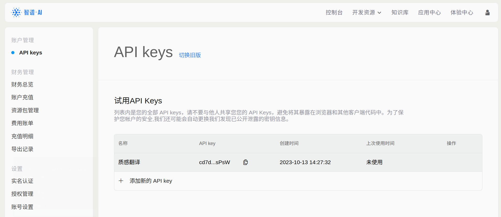

# 智谱 AI

::: info 注意
此文档内容可能会过时，请以[智谱 AI 开放平台](https://open.bigmodel.cn/)内容为准。
:::

## 智谱 AI API 定价

根据[官方文档](https://open.bigmodel.cn/pricing)，智谱 AI 支持 3 种模型，定价如下：

| 模型         | 单价                                             |
| ------------ | ------------------------------------------------ |
| ChatGLM-Pro  | 0.01 元 / 千 tokens                              |
| ChatGLM-Std  | 0.005 元 / 千 tokens                             |
| ChatGLM-Lite | 0.002 或 0.04 元 / 千 tokens（取决于上下文程度） |

Token 是模型用来表示自然语言文本的基本单位，可以直观的理解为“字”或“词”；通常 1 个中文词语、1 个英文单词、1 个数字或 1 个符号计为 1 个 token。一般情况下 ChatGLM 模型中 token 和字数的换算比例约为 1:1.8 ，但因为不同模型的分词不同，所以换算比例也存在差异。

> 质感翻译默认调用 ChatGLM-Std 模型。

首次注册的用户会赠送 15 元体验金，体验金耗尽后，才根据接口调用量在账户余额进行扣费。

::: info 说明
费用由智谱 AI 在智谱 AI 开放平台收取，与「质感翻译」无关。
:::

## API 申请步骤

### 第一步：登录智谱 AI 开放平台

访问[智谱 AI 开放平台](https://open.bigmodel.cn/)，点击右上角登录或注册账号。

### 第二步：完成实名认证

访问[智谱 AI 开放平台实名认证](https://open.bigmodel.cn/usercenter/auth)，根据提示完成实名认证，可选择个人认证或企业认证。

### 第三步：查看并填写 API Key

账号注册后，系统会生成一个默认的 API Key ，可以前往[智谱 AI 开放平台 API Keys](https://open.bigmodel.cn/usercenter/apikeys) 查看。也可以添加新的 API Key 使用。

进入质感翻译设置页面，依次点击「翻译服务」-「智谱 AI」，将「API Key」填入对应位置并保存。

现在就可以在「质感翻译」中使用智谱 AI 翻译服务了。

## 模型调参

「质感翻译」对接了智谱 AI 的一些模型调参接口，可以根据自己的需求调整模型的参数，以获得更准确、更个性化的翻译结果。调整参数请前往「应用设置」-「翻译服务」-「智谱 AI」。

可选的参数及其含义如下：

### 语言模型

智谱 AI 提供了 3 个语言模型可供选择，分别为：

| 模型         | 说明                                                 | 上下文长度 |
| ------------ | ---------------------------------------------------- | ---------- |
| ChatGLM-Pro  | 适用于对知识量、推理能力、创造力要求较高的场景       | 8K         |
| ChatGLM-Std  | 适用于需要兼顾效果和成本的场景                       | 8K         |
| ChatGLM-Lite | 适用于对反应速度和成本比较敏感，且任务较为简单的场景 | 8K 或 32k  |

> 「质感翻译」默认使用 ChatGLM-Std 模型。

### 采样温度

采样温度用于控制输出的随机性，必须为正数取值范围是：(0.0,1.0]，不能等于 0，值越大，会使输出更随机，更具创造性；值越小，输出会更加稳定或确定。

> 「质感翻译」使用 0.8 作为采样温度的默认值。

### Propmt

调用语言模型时，将当前 Prompt 对话信息列表作为提示输入给模型。

> 「质感翻译」默认 Prompt 为：
>
> - 用户：你是一名翻译专家，请将我给你的文本翻译成口语化、专业化、优雅流畅的内容，不要有机器翻译的风格。你必须只返回文本内容的翻译结果，不要解释文本内容。
> - 机器人：好的，我只翻译文字内容，不会解释。
> - 用户：将下面的文本翻译为中文：hello
> - 机器人：你好
> - 用户：将下面的文本翻译为\{to\}：\{text\}
>
> 其中 `{to}` 和 `{text}` 在翻译时会被替换为目标语言和原文。

## 语言支持

做为一个国产 AI 大模型，智谱 AI 对支持那些语言的翻译，我也不知道……
